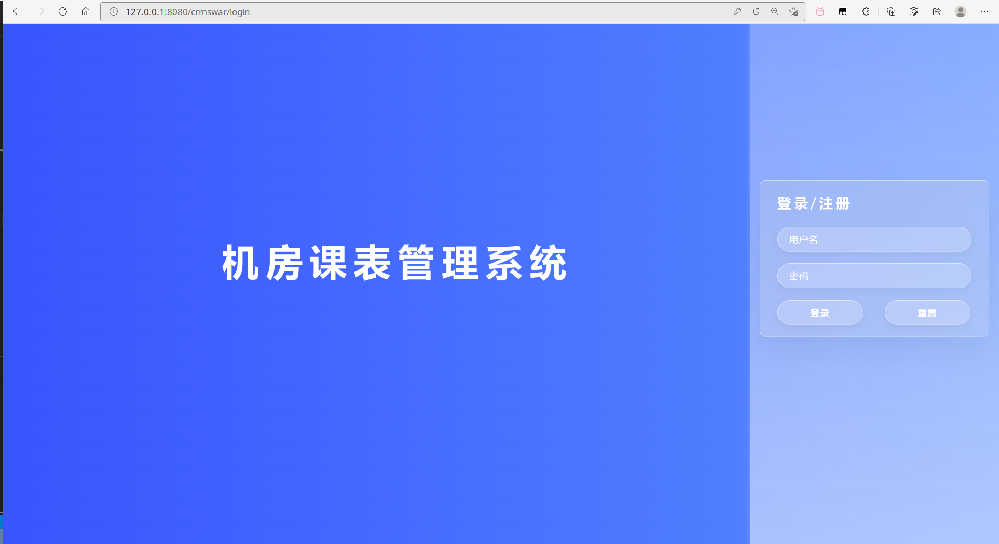
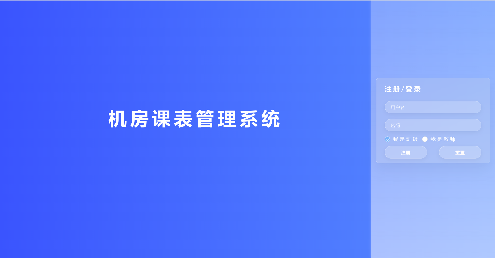
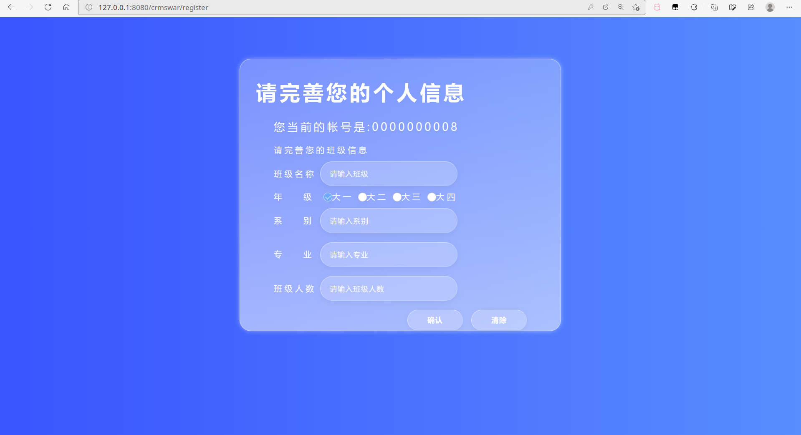
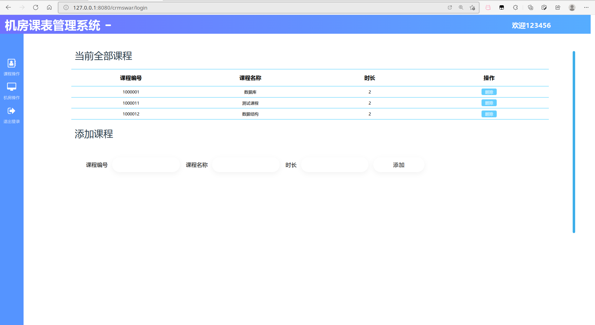
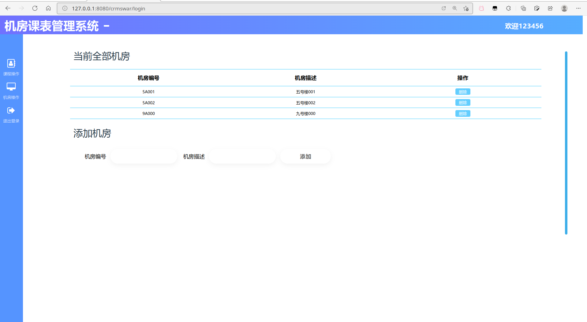
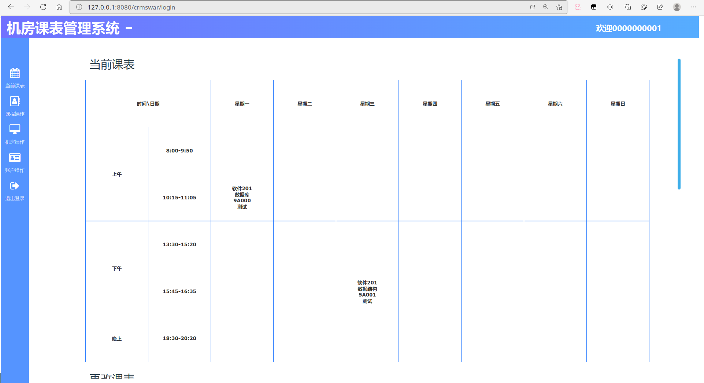
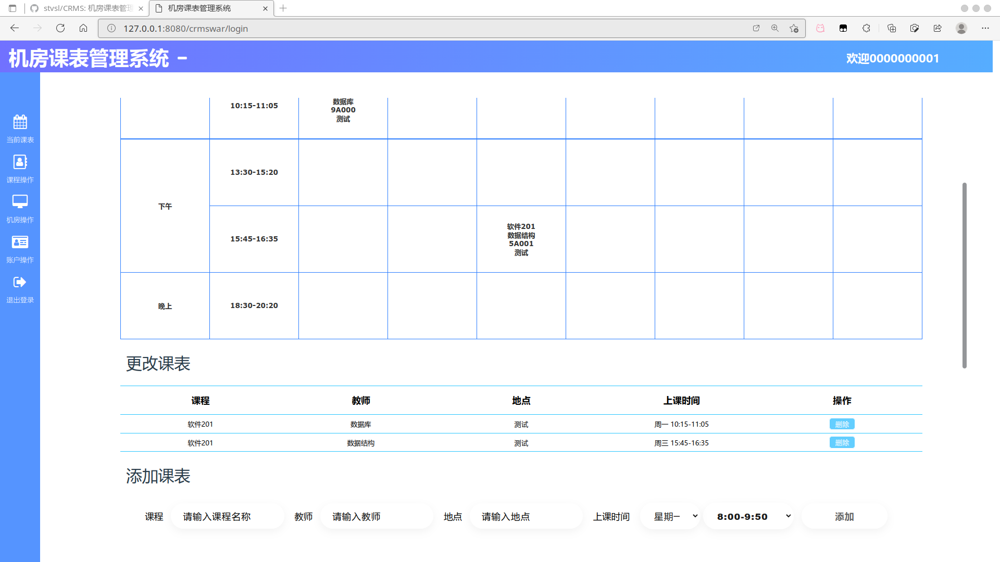
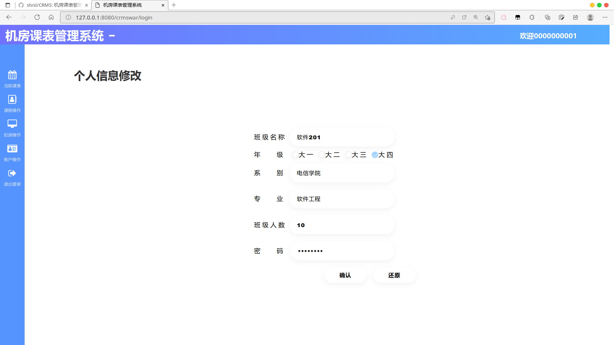

# CRMS(机房课表管理系统)

#### 系统要求

​				Tomcat 10，java 18, 使用maven，IDE为VScode, 数据库为MariaDB（可使用MySQL8的数据库驱动，语法也相同）

#### github地址

​				https://github.com/stvsl/CRMS.git

#### 个人博客地址

​				http://stvsl.stvsljl.com

#### 注意事项

​				部分功能并未实际完成，例如教师身份登录的课表排课功能，还有管理员相关的部分功能缺失，如果需要的话，您可以自行完善，如需技术支持请联系QQ：2997895526

#### 效果预览

